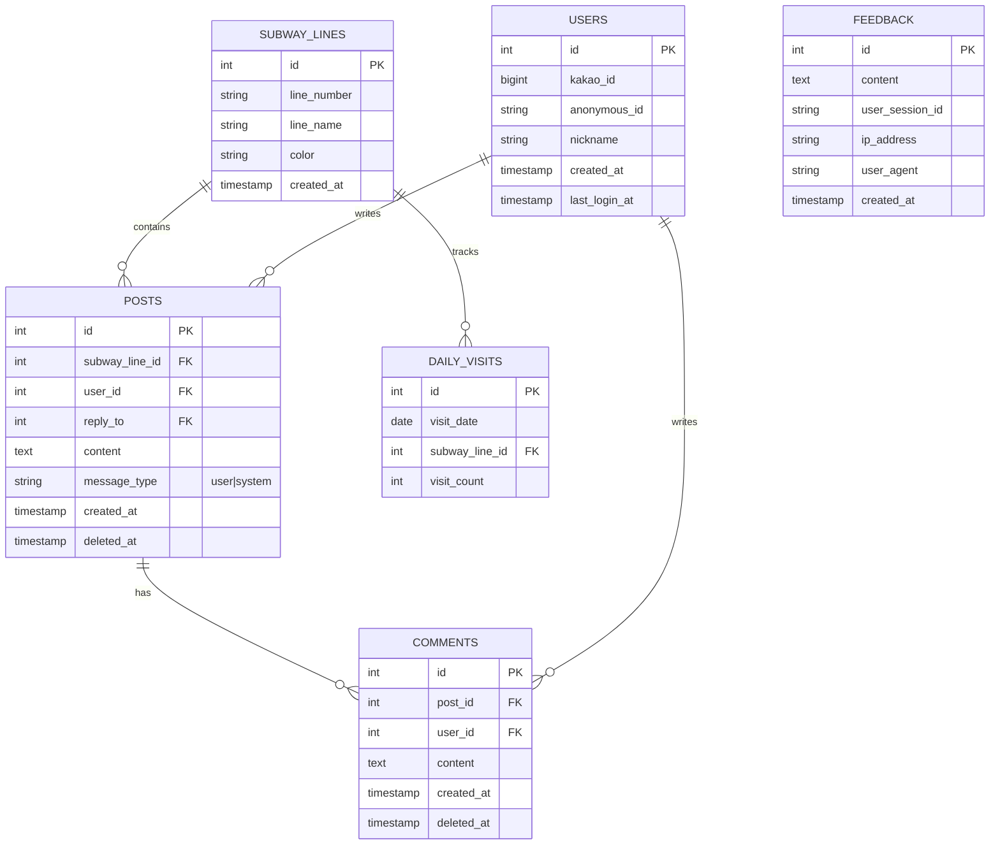

# ???? - ??? ??? ?? ??

> "?? ??, ?? ???? ??? ????"
>
> ?? ??, ?? ???? ???? ???? ?? ??? ??? ???? ??? ?? ??????.

<div align="center">

[](https://gagisiro.com)
[](https://nodejs.org/)
[](https://react.dev/)
[](https://vitejs.dev/)
[](https://expressjs.com/)

?? **Live Demo**: [https://gagisiro.com](https://gagisiro.com)

</div>

---

## ??

- [???? ??](#????-??)
- [?? ??](#??-??)
- [?? ??](#??-??)
- [??? ??](#???-??)
- [???? ??](#????-??)
- [?? ??](#??-??)
- [???](#???)
- [??](#??)

---

## ???? ??

| ?? | ?? |
|------|------|
| **?????** | ???? (??? ?? ??) |
| **?? ??** | 2025.12 ~ 2026.01 |
| **?? ??** | 1? (??, ???, ??, ??) |
| **??? URL** | [gagisiro.com](https://gagisiro.com) |

---

## ?? ??

### ??? ??
- 1~9?? ?? ?? ??
- Socket.IO ?? ??? ??? ??
- ??? ??? ? ??? ??

### ?? ?? ?? (?? ?? ??)
- ?? 07:00~09:00? ?? (?? ??)
- ?????/?? ?? ??
- ??? ?? ?? ? ?? ?? ??
- ??/??? ????? ?? ???? ?? ??

### ?? ??
- ????/??? ?? ?? ??
- ?? ?? ID ?? ??? ??
- ??? ???? ?? ??? ??? ???

### ??(Reply)
- ?? ???? ?? ??
- ?? ?? ??? ???? ??
- DB? `reply_to`? ??

### ??? ??(?? ?? ??)
- ?? 00:00 ?? ???/?? ?? ???? ??
- ?? ??? ??? ?? ???? ??

---

## ?? ??

### Frontend
- React 19
- Vite 6
- React Router 7
- Socket.IO Client
- Axios

### Backend
- Node.js 22 LTS
- Express 5
- Socket.IO
- PostgreSQL
- Helmet / Rate Limit / CORS

### Infra
- Frontend: Vercel
- Backend/DB: Railway

---

## ??? ??

?? ??? ?? (?? ??? ??):

- `subway_lines`: ?? ??
- `posts`: ??? (reply_to ??)
- `comments`: ??
- `users`: ??/??? ???
- `feedback`: ???
- `daily_visits`: ?? ?? ??



---

## ???? ??

```
subway-board/
?? frontend/
?  ?? src/
?  ?  ?? pages/            # HomePage, LinePage
?  ?  ?? components/       # UI ????
?  ?  ?? hooks/            # useChatSocket, useSwipeReply ?
?  ?  ?? services/         # API ?????
?  ?  ?? utils/            # ????/?? ??
?  ?  ?? App.jsx
?  ?? vite.config.js
?? backend/
?  ?? src/
?  ?  ?? routes/
?  ?  ?? controllers/
?  ?  ?? middleware/
?  ?  ?? services/
?  ?  ?? utils/
?  ?  ?? db/
?  ?? package.json
?? README.md
```

---

## ?? ??

### ?? ????
- Node.js 22.x
- PostgreSQL 16.x

### Quick Start
```bash
# Backend
cd backend
cp .env.example .env
npm install
npm run dev

# Frontend
cd frontend
npm install
npm run dev
```

---

## ???

```bash
cd backend
npm test
```

---

## ??

- Frontend: Vercel
- Backend/DB: Railway

---

<div align="center">

*? ????? ?? ????? ???? ??????, ?? ??? ?? ???? ?????.*

</div>
