# 가기싫어 - 출근길 익명 채팅방

> **"오늘 아침, 당신의 출근길은 어땠나요?"**
>
> 같은 호선, 같은 방향으로 향하는 수많은 사람들. 하지만 서로의 표정은 읽을 수 없어 더욱 삭막한 아침.
> 이 프로젝트는 **'가장 붐비는 시간, 가장 외로운 사람들'**을 연결하기 위해 시작된 **디지털 대나무 숲**입니다.

<div align="center">

[](https://gagisiro.com)
[](https://nodejs.org/)
[](https://react.dev/)
[](https://vitejs.dev/)
[](https://expressjs.com/)

**Live Demo**: [https://gagisiro.com](https://gagisiro.com) | **운영 시간**: 평일 07:00 ~ 09:00

</div>

---

## 목차

- [프로젝트 개요](#프로젝트-개요)
- [주요 기능](#주요-기능)
- [기술 스택](#기술-스택)
- [시스템 아키텍처](#시스템-아키텍처)
- [기술적 도전과 해결](#기술적-도전과-해결)
- [프로젝트 구조](#프로젝트-구조)
- [로컬 실행 방법](#로컬-실행-방법)
- [테스트 전략](#테스트-전략)
- [성능 및 확장성](#성능-및-확장성)

---

## 프로젝트 개요

| 항목 | 내용 |
|------|------|
| **프로젝트명** | 가기싫어 (출근길 익명 채팅방) |
| **개발 기간** | 2025.12 ~ 2026.01 (약 6주) |
| **개발 인원** | 1인 (기획, 디자인, 개발, 배포) |
| **서비스 URL** | [gagisiro.com](https://gagisiro.com) |

---

## 주요 기능

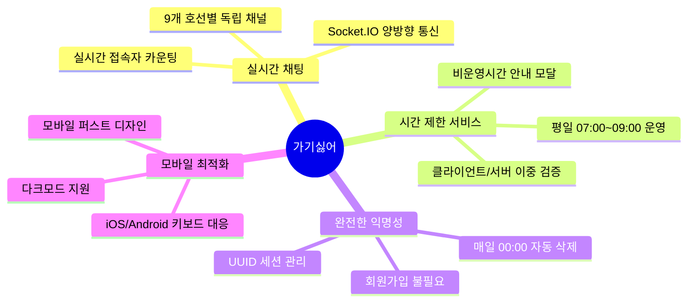

### 호선별 실시간 채팅
- 1호선부터 9호선까지 9개 독립 채널 운영
- Socket.IO 기반 실시간 양방향 통신
- 호선별 실시간 접속자 수 표시 (1초 단위 업데이트)

### 시간 제한 서비스
- 평일 오전 7시~9시에만 접속 가능
- 클라이언트/서버 이중 검증으로 우회 방지
- 비운영 시간 접속 시 안내 모달 표시

### 완전한 익명성
- 회원가입/로그인 없이 즉시 참여
- UUID 기반 세션 관리 (서버에 개인정보 저장 안함)
- 매일 자정(00:00) 모든 메시지 자동 삭제

### 답장(Reply) 기능
- 특정 메시지에 답장 가능
- 원본 메시지 미리보기 제공
- DB에 `reply_to` 필드로 연결

### 피드백 시스템
- 서비스 개선을 위한 사용자 피드백 수집
- 익명 피드백 제출 지원

### 콘텐츠 필터링
- 비속어 자동 필터링으로 건전한 채팅 환경 유지
- XSS 방지 처리

### 모바일 최적화
- 모바일 퍼스트 반응형 디자인
- iOS/Android 키보드 대응 (visualViewport API)
- 시스템 다크모드 자동 지원

---

## 기술 스택

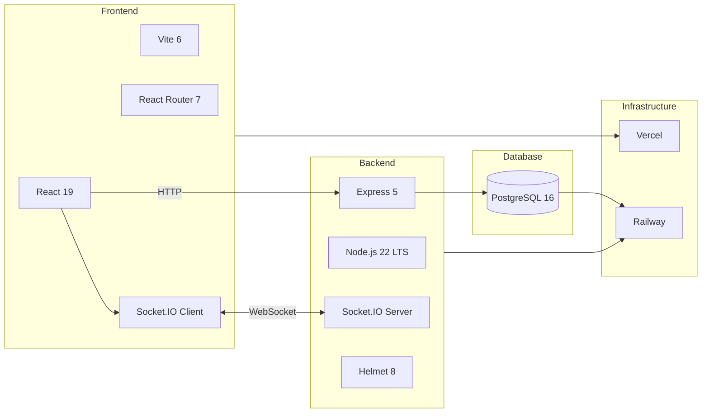

### Frontend
| 기술 | 버전 | 선택 이유 |
|------|------|----------|
| **React** | 19.2 | 최신 Hooks 패턴, 컴포넌트 기반 아키텍처 |
| **Vite** | 6.0 | CRA 대비 10배 빠른 HMR, ES 모듈 기반 빌드 |
| **React Router** | 7.11 | SPA 라우팅, 중첩 라우트 지원 |
| **Socket.IO Client** | 4.8 | 실시간 양방향 통신 |
| **Axios** | 1.13 | HTTP 클라이언트, 인터셉터 지원 |

### Backend
| 기술 | 버전 | 선택 이유 |
|------|------|----------|
| **Node.js** | 22 LTS | 최신 LTS, 향상된 성능 |
| **Express** | 5.0 | async/await 네이티브 지원, 개선된 라우팅 |
| **Socket.IO** | 4.8 | WebSocket 추상화, Room 기반 브로드캐스트 |
| **PostgreSQL** | 16 | 안정적인 RDBMS, JSON 지원 |
| **Helmet** | 8.0 | HTTP 보안 헤더 자동 설정 |
| **Winston** | 3.19 | 구조화된 로깅 시스템 |
| **node-cron** | 3.0 | 일일 데이터 정리 스케줄링 |

### Infrastructure
| 서비스 | 용도 |
|--------|------|
| **Vercel** | 프론트엔드 배포, CDN, CI/CD |
| **Railway** | 백엔드 배포, PostgreSQL 호스팅 |

---

## 시스템 아키텍처

### 전체 아키텍처
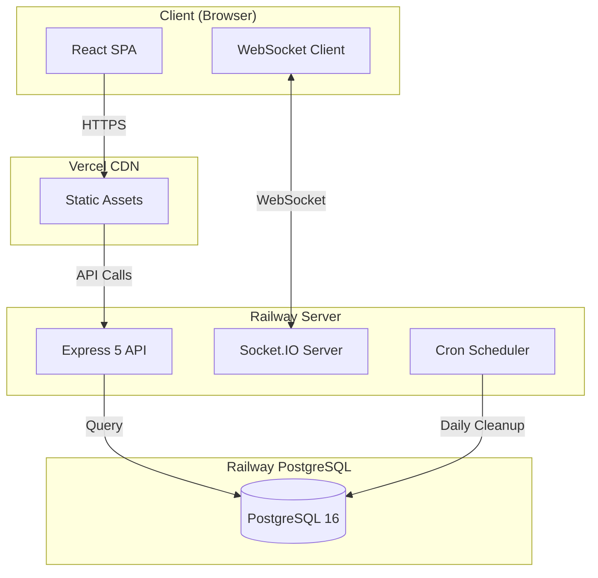

### 실시간 채팅 흐름 (Sequence Diagram)
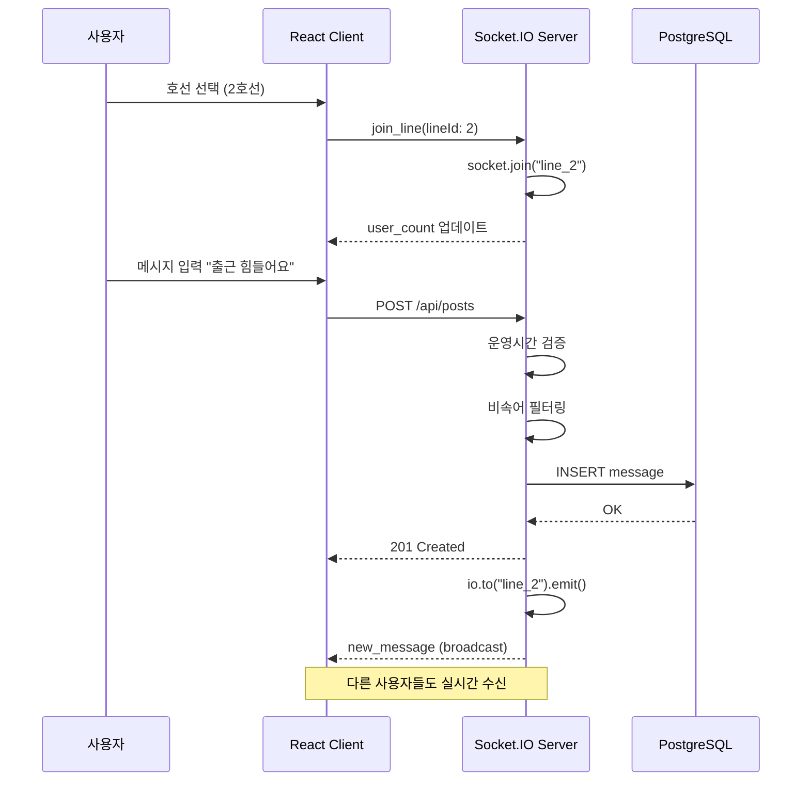

### 데이터베이스 설계 (ERD)
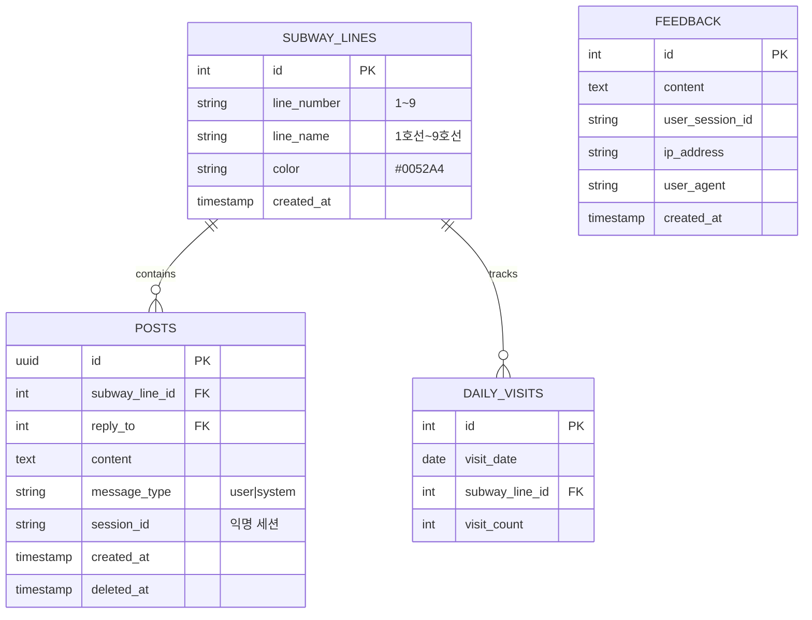

### WebSocket 이벤트 흐름
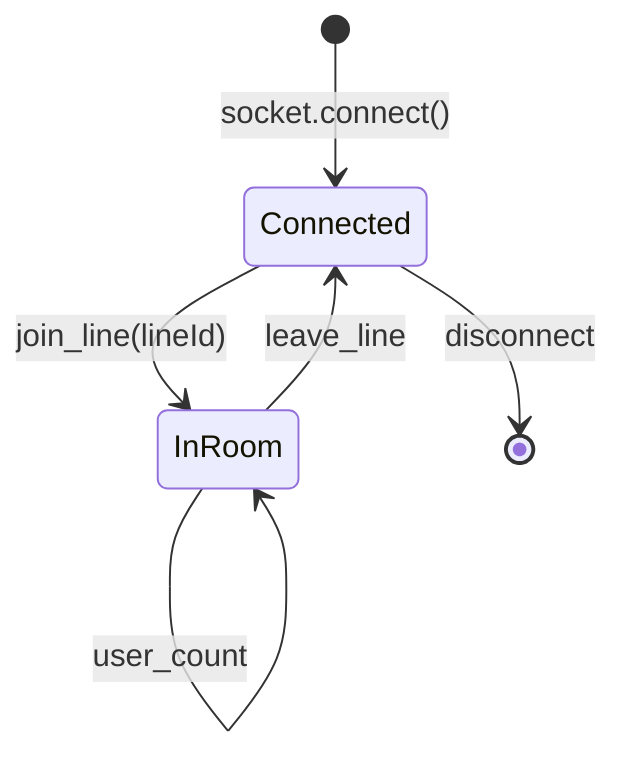

---

## 기술적 도전과 해결

### 1. 배포 환경 트러블슈팅
| 문제 | 원인 | 해결 |
|------|------|------|
| Railway 서버 크래시 | devDependencies 미설치 | `NPM_CONFIG_PRODUCTION=false` 설정 |
| 포트 바인딩 실패 | 하드코딩된 포트 | `process.env.PORT` 동적 할당 |

### 2. 운영 시간 이중 검증
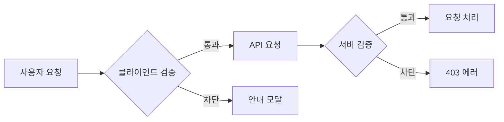
- **클라이언트**: 빠른 UX를 위한 1차 검증
- **서버**: API 요청 시 2차 검증 (우회 방지)

### 3. 실시간 접속자 카운팅
```javascript
// Socket.IO Room 기반 카운팅
io.on('connection', (socket) => {
  socket.on('join_line', (lineId) => {
    socket.join(`line_${lineId}`);
    updateUserCount(lineId);
  });
});
```

### 4. Express 5 마이그레이션
| 변경사항 | Express 4 | Express 5 |
|----------|-----------|-----------|
| 와일드카드 라우팅 | `app.all('*')` | `app.all('/{*path}')` |
| async 에러 핸들링 | try-catch 필요 | 네이티브 지원 |
| path-to-regexp | v1 | v8 |

### 5. Railway 헬스체크 타임아웃
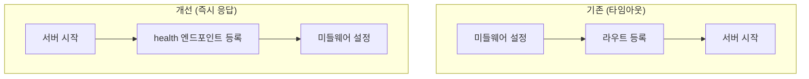

### 6. 모바일 키보드 대응
```javascript
// visualViewport API 활용
window.visualViewport?.addEventListener('resize', () => {
  const keyboardHeight = window.innerHeight - window.visualViewport.height;
  // 입력창 위치 조정
});
```

### 7. 끊김 없는 대화 경험 (Consecutive Chat UX)
- **문제**: 전송 버튼 클릭 시 `button`으로 포커스가 이동하여 모바일 키보드가 닫히는 현상 발생
- **해결**: `preventDefault`로 버튼의 포커스 진입을 차단하여, 입력창(`textarea`)의 포커스를 유지. 연속적인 메시지 전송 시에도 키보드가 유지됨.

### 8. CRA → Vite 마이그레이션
| 항목 | CRA | Vite |
|------|-----|------|
| 개발 서버 시작 | ~10초 | ~1초 |
| HMR 속도 | ~2초 | ~50ms |
| 프로덕션 빌드 | ~60초 | ~20초 |
| 환경변수 접두사 | `REACT_APP_*` | `VITE_*` |

### 9. Frontend 리팩토링 및 안정성 강화
- **Custom Hooks 분리**: 800줄에 달하던 `LinePage.jsx`를 `useChatSocket`, `useChatScroll`, `useSwipeReply` 등 3개의 Hooks로 분리하여 유지보수성 향상
- **Integration Test 도입**: `supertest`를 도입하여 백엔드 핵심 비즈니스 로직(`postController`)의 안정성 검증 자동화

### 10. 낙관적 업데이트 (Optimistic Update) 구현
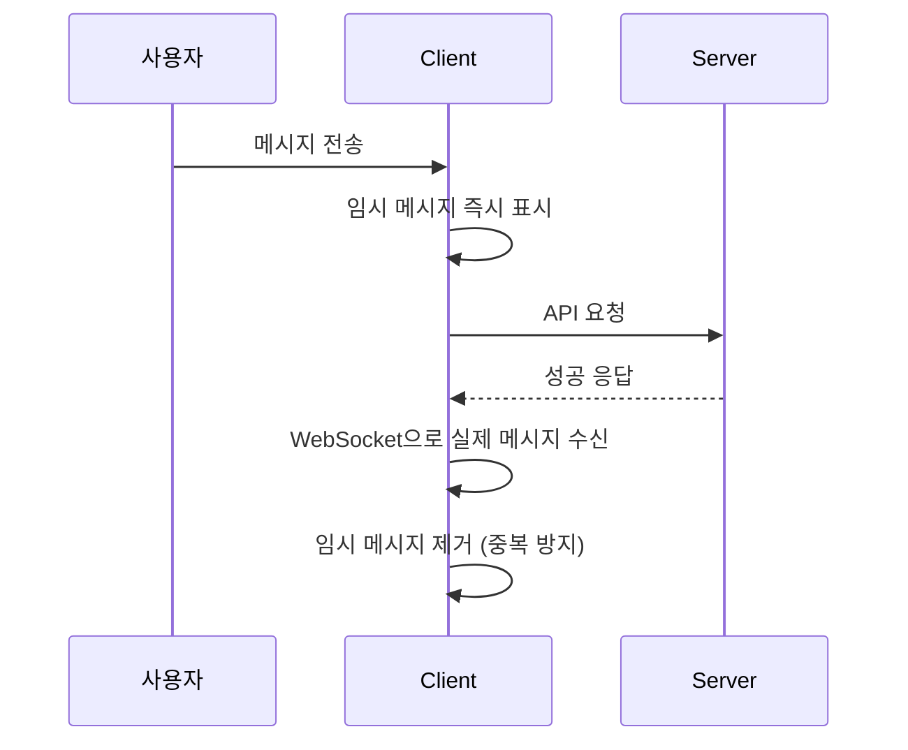
- **체감 속도 향상**: 서버 응답 대기 없이 즉시 UI 반영
- **실패 시 롤백**: 에러 발생 시 임시 메시지 제거 및 입력 내용 복원

### 11. 일별 방문자 통계 시스템
```sql
-- 일별 호선별 접속자 수 테이블
CREATE TABLE daily_visits (
  visit_date DATE,
  subway_line_id INTEGER,
  visit_count INTEGER,
  UNIQUE(visit_date, subway_line_id)
);
```
- **UPSERT 패턴**: 같은 날짜+호선이면 카운트 증가
- **통계 API**: `GET /api/admin/stats?days=7`

---

## 프로젝트 구조

```
subway-board/
├── frontend/                    # React 프론트엔드
│   ├── src/
│   │   ├── components/          # 재사용 컴포넌트
│   │   │   ├── ClosedAlertModal.jsx
│   │   │   ├── FeedbackModal.jsx
│   │   │   ├── SessionExpiredModal.jsx
│   │   │   └── Toast.jsx
│   │   ├── contexts/            # React Context (AuthContext)
│   │   ├── hooks/               # 커스텀 훅
│   │   │   ├── useChatSocket.js   # 소켓 연결/메시지 관리
│   │   │   ├── useChatScroll.js   # 스크롤 동작
│   │   │   ├── useSwipeReply.js   # 스와이프 답장
│   │   │   └── useToast.js        # 토스트 알림
│   │   ├── pages/               # 페이지 컴포넌트
│   │   │   ├── HomePage.jsx       # 호선 선택
│   │   │   └── LinePage.jsx       # 채팅방
│   │   ├── services/            # API 서비스
│   │   │   └── api.js             # axios 인스턴스
│   │   └── utils/               # 유틸리티
│   │       ├── operatingHours.js  # 운영시간 체크
│   │       ├── socket.js          # Socket.IO 클라이언트
│   │       └── temporaryUser.js   # 임시 사용자 관리
│   ├── index.html               # Vite 엔트리
│   └── vite.config.js           # Vite 설정
│
├── backend/                     # Express 백엔드
│   ├── src/
│   │   ├── config/              # 설정
│   │   │   └── constants.js       # Rate limit, 콘텐츠 제한 등
│   │   ├── controllers/         # 컨트롤러
│   │   │   ├── postController.js    # 메시지 CRUD
│   │   │   ├── visitController.js   # 방문 통계
│   │   │   └── feedbackController.js
│   │   ├── db/                  # DB 관련
│   │   │   ├── connection.js      # PostgreSQL 연결
│   │   │   ├── schema.sql         # 테이블 정의
│   │   │   └── migrate.js         # 마이그레이션
│   │   ├── middleware/          # 미들웨어
│   │   │   ├── checkOperatingHours.js  # 운영시간 검증
│   │   │   ├── authMiddleware.js       # 인증
│   │   │   └── validator.js            # 입력 검증
│   │   ├── routes/              # API 라우트
│   │   └── utils/               # 유틸리티
│   │       ├── scheduler.js       # 일일 데이터 정리 (node-cron)
│   │       ├── activeUsers.js     # 접속자 카운팅
│   │       ├── profanityFilter.js # 비속어 필터링
│   │       └── logger.js          # Winston 로깅
│   ├── tests/                   # 테스트
│   │   ├── health.test.js
│   │   ├── post.test.js
│   │   └── validator.test.js
│   └── index.js                 # 서버 엔트리
│
├── designs/                     # UI 디자인 목업
├── RESTORE.md                   # 테스트→정식 원복 가이드
└── README.md                    # 프로젝트 문서
```

---

## 로컬 실행 방법

### 요구 사항
- Node.js 22.x 이상
- PostgreSQL 16.x 이상
- npm 10.x 이상

### Quick Start
```bash
# 1. 저장소 클론
git clone https://github.com/your-repo/subway-board.git
cd subway-board

# 2. Backend 실행
cd backend
cp .env.example .env  # DATABASE_URL 설정 필요
npm install
npm run dev           # http://localhost:5000

# 3. Frontend 실행 (새 터미널)
cd frontend
npm install
npm run dev           # http://localhost:3000
```

---

## 테스트 전략

### 3-Layer 테스트 전략

| Layer | 대상 | 도구 | 목적 |
|-------|------|------|------|
| **Unit** | `validator.js` | Jest | XSS/SQL Injection 차단 검증 |
| **Business** | `operatingHours.js` | Jest + Fake Timers | 운영시간 로직 검증 |
| **Integration** | `postController.js` | Supertest | API 엔드포인트 및 DB 연동 검증 |
| **System** | `/health` API | Supertest | 시스템 가용성 확인 |

```bash
# 테스트 실행
cd backend
npm test
```

---

## 성능 및 확장성

### 현재 아키텍처 지원 범위

| 동시 접속자 | 상태 | 대응 방안 |
|------------|------|----------|
| ~100명 | 안정 | 현재 설정 |
| ~500명 | 주의 | 모니터링 강화 |
| ~1,000명 | 업그레이드 | 서버 스펙 상향 |
| 1,000명+ | 아키텍처 변경 | Redis + 로드밸런서 |

### 향후 확장 계획
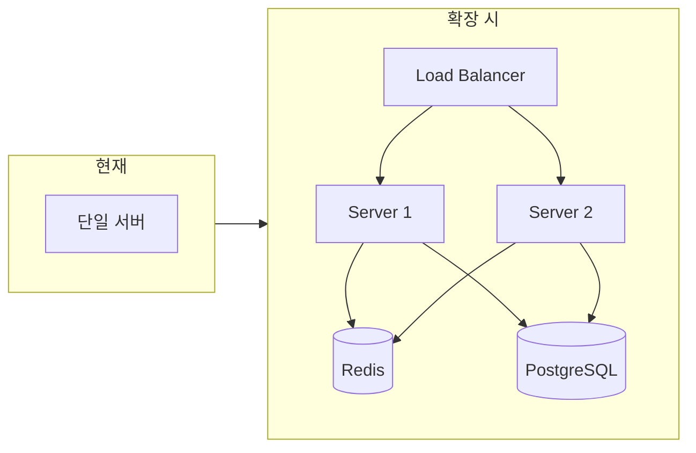

---

## 보안 고려사항

| 보안 영역 | 구현 내용 |
|----------|----------|
| **HTTP 헤더** | Helmet.js로 보안 헤더 자동 설정 |
| **Rate Limiting** | API 요청 제한 (쓰기: 15분당 50회, 읽기: 1분당 100회) |
| **CORS** | 허용된 도메인만 접근 가능 |
| **Input Validation** | XSS 필터링, 메시지 길이 검증 |
| **SQL Injection** | Parameterized Query 사용 |
| **콘텐츠 필터링** | 비속어 자동 필터링 |

---

## 개발 타임라인

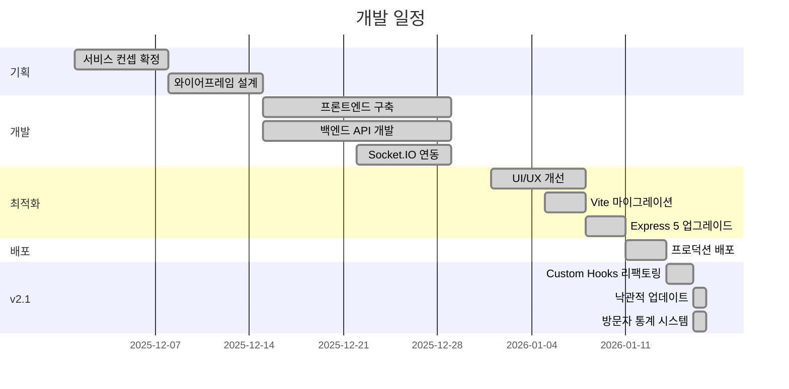

---

## 개발자 정보

이 프로젝트는 **프론트엔드/백엔드 풀스택 역량**을 보여주기 위한 개인 사이드 프로젝트입니다.

### 프로젝트를 통해 경험한 것들
- React 19 + Vite 6 기반 SPA 개발
- Express 5 + Socket.IO 실시간 서버 구축
- PostgreSQL 데이터베이스 설계 및 연동
- Vercel/Railway를 활용한 CI/CD 파이프라인
- 모바일 퍼스트 반응형 웹 개발
- 레거시 스택 최신 버전 마이그레이션 경험

---

## License

MIT License - 자유롭게 사용, 수정, 배포 가능합니다.

---

<div align="center">

*이 프로젝트는 개인 포트폴리오 목적으로 제작되었으며, 실제 지하철 운영 주체와는 무관합니다.*

**Made with care by a developer who also hates Monday mornings**

</div>
