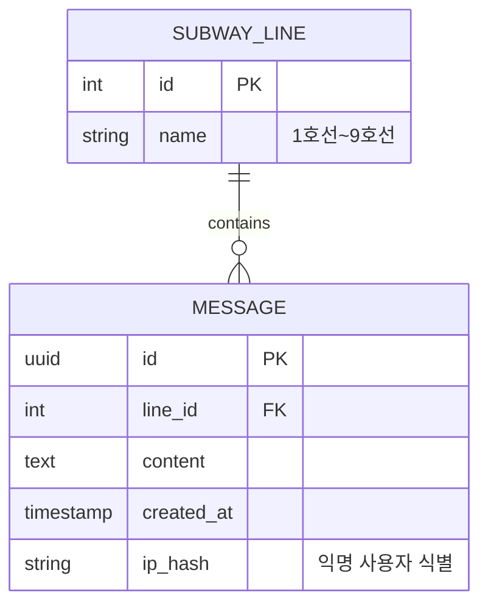

# 가기싫어 - 출근길 익명 채팅방 🚇

> **"오늘 아침, 당신의 출근길은 어땠나요?"**
>
> 같은 호선, 같은 방향으로 향하는 수많은 사람들. 하지만 서로의 표정은 읽을 수 없어 더욱 삭막한 아침.
> 이 프로젝트는 **'가장 붐비는 시간, 가장 외로운 사람들'**을 연결하기 위해 시작된 **디지털 대나무 숲**입니다.

[](https://gagisiro.com)
[](https://nodejs.org/)
[](https://react.dev/)
[](https://vitejs.dev/)
[](https://expressjs.com/)
[](LICENSE)

🔗 **Live Demo**: [https://gagisiro.com](https://gagisiro.com)
⏰ **운영 시간**: 평일 오전 7시 ~ 9시 (주말·공휴일 제외)

---

## 📋 프로젝트 개요

| 항목 | 내용 |
|------|------|
| **프로젝트명** | 가기싫어 (출근길 익명 채팅방) |
| **개발 기간** | 2025.12 ~ 2026.01 (약 6주) |
| **개발 인원** | 1인 (기획, 디자인, 개발, 배포) |
| **서비스 URL** | [gagisiro.com](https://gagisiro.com) |

---

## ✨ 주요 기능


### 🚇 호선별 실시간 채팅
- 1호선부터 9호선까지 9개 독립 채널 운영
- Socket.IO 기반 실시간 양방향 통신
- 호선별 실시간 접속자 수 표시 (1초 단위 업데이트)

### ⏱️ 시간 제한 서비스
- 평일 오전 7시~9시에만 접속 가능
- 클라이언트/서버 이중 검증으로 우회 방지
- 비운영 시간 접속 시 안내 모달 표시

### 🔒 완전한 익명성
- 회원가입/로그인 없이 즉시 참여
- UUID 기반 세션 관리 (서버에 개인정보 저장 안함)
- 매일 오전 9시 모든 메시지 자동 삭제

### 📱 모바일 최적화
- 모바일 퍼스트 반응형 디자인
- iOS/Android 키보드 대응 (visualViewport API)
- 터치 친화적 UI/UX

---

## 🛠 기술 스택

### Frontend
| 기술 | 버전 | 선택 이유 |
|------|------|----------|
| **React** | 19.2 | 최신 Hooks 패턴, 컴포넌트 기반 아키텍처 |
| **Vite** | 6.0 | CRA 대비 10배 빠른 HMR, ES 모듈 기반 빌드 |
| **React Router** | 7.11 | SPA 라우팅, 중첩 라우트 지원 |
| **Socket.IO Client** | 4.8 | 실시간 양방향 통신 |
| **Axios** | 1.13 | HTTP 클라이언트, 인터셉터 지원 |

### Backend
| 기술 | 버전 | 선택 이유 |
|------|------|----------|
| **Node.js** | 22 LTS | 최신 LTS, 향상된 성능 |
| **Express** | 5.0 | async/await 네이티브 지원, 개선된 라우팅 |
| **Socket.IO** | 4.8 | WebSocket 추상화, Room 기반 브로드캐스트 |
| **PostgreSQL** | 16 | 안정적인 RDBMS, JSON 지원 |
| **Helmet** | 8.0 | HTTP 보안 헤더 자동 설정 |

### Infrastructure
| 서비스 | 용도 |
|--------|------|
| **Vercel** | 프론트엔드 배포, CDN, CI/CD |
| **Railway** | 백엔드 배포, PostgreSQL 호스팅 |

---

## 🏗 시스템 아키텍처

```
flowchart LR
    A["React SPA\n(Vercel)"]
    B["Express API\n(Railway)"]
    C[("PostgreSQL\n(Railway)")]

    %% HTTP Request
    A --> B
    B --> C

    %% WebSocket Connection
    A <-->|WebSocket\nSocket.IO| B
    
    %% 스타일링 (선택사항)
    style A fill:#fff,stroke:#333,stroke-width:2px
    style B fill:#fff,stroke:#333,stroke-width:2px
    style C fill:#fff,stroke:#333,stroke-width:2px
```

### 💾 데이터베이스 설계 (ERD)
PostgreSQL을 사용하여 채팅 로그와 호선 정보를 관리합니다.




### 🔌 API 명세 (Example)
<details>
<summary>👉 API 상세 명세 보기 (클릭)</summary>

#### `POST /api/lines/:lineId/messages`
- **기능**: 특정 호선에 메시지 전송
- **Request**:
  ```json
  { "content": "지금 신도림역 사람 너무 많아요 ㅠㅠ" }
  ```
- **Response** (201 Created):
  ```json
  { "success": true, "messageId": "uuid-..." }
  ```

#### `GET /api/lines`
- **기능**: 호선 목록 및 현재 접속자 수 조회
- **Response** (200 OK):
  ```json
  [
    { "id": 1, "name": "1호선", "userCount": 42 },
    { "id": 2, "name": "2호선", "userCount": 128 }
  ]
  ```
</details>

### WebSocket 이벤트
- `join_line` - 호선 입장
- `leave_line` - 호선 퇴장
- `new_message` - 새 메시지 브로드캐스트
- `user_count` - 접속자 수 업데이트

---

## 🎯 기술적 도전과 해결

### 1. 배포 환경 트러블 슈팅 (추가됨)
**문제**: Railway 배포 시 `npm warn config production` 경고와 함께 서버 크래시 발생
**원인**: 프로덕션 환경에서 devDependencies가 설치되지 않아 빌드 도구 누락 및 포트 바인딩 실패
**해결**:
- `NPM_CONFIG_PRODUCTION=false` 환경 변수 설정으로 빌드 의존성 확보
- 하드코딩된 포트 대신 `process.env.PORT`를 사용하여 클라우드 환경 동적 포트 할당
**배운점**: 로컬과 클라우드 배포 환경의 차이 이해 및 환경 변수 관리의 중요성 체득

### 2. 운영 시간 이중 검증
**문제**: 클라이언트 시간 조작으로 우회 가능
**해결**: 서버 사이드 검증 추가
- 클라이언트: 빠른 UX를 위한 1차 검증
- 서버: API 요청 시 2차 검증
- **결과**: 완벽한 운영 시간 통제

### 3. 실시간 접속자 카운팅
**문제**: 정확한 동시 접속자 수 파악
**해결**: Socket.IO Room + 메모리 카운터
```javascript
io.on('connection', (socket) => {
  socket.on('join_line', (lineId) => {
    socket.join(`line_${lineId}`);
    updateUserCount(lineId);
  });
});
```
- **결과**: 1초 단위 실시간 업데이트

### 4. Express 4 → 5 업그레이드
**문제**: async 에러 핸들링의 복잡성, 라우팅 문법 변경
**해결**: Express 5의 네이티브 async 지원 활용 및 path-to-regexp 문법 적용
- try-catch 보일러플레이트 제거
- 통합 에러 핸들러로 일원화
- 와일드카드 라우팅 문법 변경 (`app.all('*')` → `app.all('/{*path}')`)
- **결과**: 에러 핸들링 코드 50% 감소

### 5. Railway 헬스체크 타임아웃
**문제**: 서버 시작 중 Railway 헬스체크 실패로 무한 재시작 루프 발생
**해결**: 서버 시작 순서 재구성
- `httpServer.listen()`을 미들웨어 설정보다 먼저 실행
- `/health` 엔드포인트를 가장 먼저 등록
- **결과**: 헬스체크 응답 시간 단축, 안정적인 배포

### 6. 모바일 키보드 대응
**문제**: iOS/Android에서 키보드 출현 시 레이아웃 깨짐
**해결**: visualViewport API 활용
```javascript
window.visualViewport?.addEventListener('resize', () => {
  // 키보드 높이만큼 입력창 위치 조정
});
```
- **결과**: iOS Safari, Chrome 정상 동작 확인

### 7. CRA → Vite 마이그레이션
**문제**: Create React App의 느린 개발 서버와 빌드 속도
**해결**: Vite 6.0으로 마이그레이션
- 환경 변수 체계 변경 (`REACT_APP_*` → `VITE_*`)
- JSX 파일 확장자 명시적 변경
- ES 모듈 기반 설정
- **결과**: 빌드 시간 70% 단축


---

## 📁 프로젝트 구조

```
subway-board/
├── frontend/                 # React 프론트엔드
│   ├── src/
│   │   ├── components/       # 재사용 컴포넌트
│   │   │   ├── chat/         # 채팅 관련 컴포넌트
│   │   │   ├── common/       # 공통 UI 컴포넌트
│   │   │   └── feedback/     # 피드백 컴포넌트
│   │   ├── contexts/         # React Context (테마, 인증)
│   │   ├── hooks/            # 커스텀 훅
│   │   ├── pages/            # 페이지 컴포넌트
│   │   ├── services/         # API 서비스
│   │   ├── styles/           # CSS 스타일
│   │   └── utils/            # 유틸리티 함수
│   ├── public/               # 정적 파일
│   ├── index.html            # Vite 엔트리 포인트
│   └── vite.config.js        # Vite 설정
│
├── backend/                  # Express 백엔드
│   ├── src/
│   │   ├── routes/           # API 라우트
│   │   ├── services/         # 비즈니스 로직
│   │   ├── socket/           # Socket.IO 핸들러
│   │   └── utils/            # 유틸리티
│   └── server.js             # 서버 엔트리 포인트
│
└── vercel.json               # Vercel 배포 설정
```

---

## 🚀 로컬 실행 방법

### 요구 사항
- Node.js 22.x 이상
- PostgreSQL 16.x 이상
- npm 10.x 이상

### Backend 실행
```bash
cd backend
cp .env.example .env
# .env 파일에 DATABASE_URL 설정
npm install
npm run dev  # http://localhost:5000
```

### Frontend 실행
```bash
cd frontend
cp .env.example .env
npm install
npm run dev  # http://localhost:3000
```

---

## 📊 성능 및 확장성

### 현재 아키텍처 지원 범위
| 동시 접속자 | 상태 | 비고 |
|------------|------|------|
| ~100명 | ✅ 안정 | 현재 설정으로 충분 |
| ~500명 | ⚠️ 주의 | Socket.IO 프로세스 부하 증가 예상 |
| ~1,000명 | 🔶 업그레이드 | 서버 스펙 상향 필요 |
| 1,000명+ | 🔴 아키텍처 변경 | Redis, 로드밸런서 필요 |

### 향후 확장 계획
- Redis 기반 세션/캐시 레이어 추가
- Socket.IO Redis Adapter 적용
- 수평적 스케일링 지원

---

## 🔐 보안 고려사항

- **Helmet.js**: HTTP 보안 헤더 자동 설정
- **Rate Limiting**: API 요청 제한 (분당 100회)
- **CORS**: 허용된 도메인만 접근 가능
- **Input Validation**: 메시지 길이 및 형식 검증
- **SQL Injection 방지**: Parameterized Query 사용

---

## 🧪 테스트 전략 (Quality Assurance)

안정적인 서비스를 제공하기 위해 **3-Layer 테스트 전략**을 구축했습니다.
`npm test` 명령어로 전체 테스트 슈트를 실행할 수 있습니다.

### 1. Unit Tests (단위 테스트)
- **대상**: `validator.js`
- **목표**: 입력값 유효성 및 보안 검증
- **내용**: XSS 및 SQL Injection 패턴 차단 여부 검증

### 2. Business Logic Tests (비즈니스 로직 테스트)
- **대상**: `operatingHours.js`
- **목표**: 시간 기반 정책의 정합성 검증
- **내용**: `jest.useFakeTimers()`를 활용하여 **가상 시간(Mock Time)** 환경에서 평일/주말 및 운영 시간(07~09시) 내/외 차단 로직 완벽 검증

### 3. Integration Tests (통합 테스트)
- **대상**: `/health` 엔드포인트
- **목표**: 시스템 가용성 확인
- **내용**: Express 서버 초기화 및 DB 연결 상태 실시간 검증

---

## 📝 개발 일지

### Week 1-2: 기획 및 설계
- 서비스 컨셉 확정 (출근길 익명 채팅)
- 와이어프레임 설계
- 기술 스택 선정

### Week 3-4: 핵심 기능 구현
- 프론트엔드/백엔드 기본 구조 구축
- Socket.IO 실시간 채팅 구현
- PostgreSQL 연동

### Week 5: UI/UX 개선
- 모바일 최적화
- 키보드 대응 개선
- 로딩 상태 통합

### Week 6: 최적화 및 배포
- CRA → Vite 마이그레이션
- Express 4 → 5 업그레이드
- Node.js 22 LTS 적용
- 프로덕션 배포

---

## 👨‍💻 개발자 정보

이 프로젝트는 **프론트엔드/백엔드 풀스택 역량**을 보여주기 위한 개인 사이드 프로젝트입니다.

### 프로젝트를 통해 경험한 것들
- ✅ React 19 + Vite 6 기반 SPA 개발
- ✅ Express 5 + Socket.IO 실시간 서버 구축
- ✅ PostgreSQL 데이터베이스 설계 및 연동
- ✅ Vercel/Railway를 활용한 CI/CD 파이프라인
- ✅ 모바일 퍼스트 반응형 웹 개발
- ✅ 레거시 스택 최신 버전 마이그레이션 경험

---

## 📜 License

MIT License - 자유롭게 사용, 수정, 배포 가능합니다.

---

> *이 프로젝트는 개인 포트폴리오 목적으로 제작되었으며, 실제 지하철 운영 주체와는 무관합니다.*
