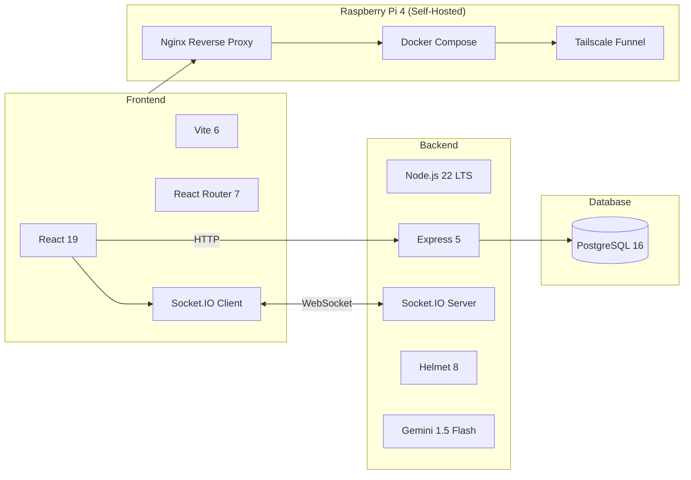
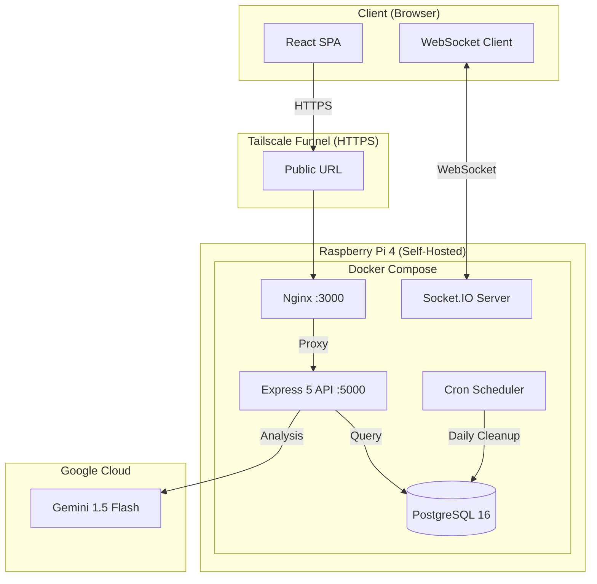

# 가기싫어 - 출근길 익명 채팅방

> **"오늘 아침, 당신의 출근길은 어땠나요?"**
>
> 같은 호선, 같은 방향으로 향하는 수많은 사람들. 하지만 서로의 표정은 읽을 수 없어 더욱 삭막한 아침.
> 이 프로젝트는 **'가장 붐비는 시간, 가장 외로운 사람들'**을 연결하기 위해 시작된 **디지털 대나무 숲**입니다.

<div align="center">

[](https://gagisiro.com)
[](https://nodejs.org/)
[](https://react.dev/)
[](https://vitejs.dev/)
[](https://expressjs.com/)

**Live Demo**: [https://gagisiro.com](https://gagisiro.com) | **운영 시간**: 평일 07:00 ~ 09:00

</div>

---

## 목차

- [프로젝트 개요](#프로젝트-개요)
- [주요 기능](#주요-기능)
- [기술 스택](#기술-스택)
- [시스템 아키텍처](#시스템-아키텍처)
- [기술적 도전과 해결](#기술적-도전과-해결)
- [프로젝트 구조](#프로젝트-구조)
- [로컬 실행 방법](#로컬-실행-방법)
- [테스트 전략](#테스트-전략)
- [성능 및 확장성](#성능-및-확장성)

---

## 프로젝트 개요

| 항목 | 내용 |
|------|------|
| **프로젝트명** | 가기싫어 (출근길 익명 채팅방) |
| **개발 기간** | 2025.12 ~ 2026.01 (약 6주) |
| **개발 인원** | 1인 (기획, 디자인, 개발, 배포) |
| **서비스 URL** | [gagisiro.com](https://gagisiro.com) |

---

## 주요 기능

```mermaid
mindmap
  root((가기싫어))
    실시간 채팅
      9개 호선별 독립 채널
      Socket.IO 양방향 통신
      실시간 접속자 카운팅
    시간 제한 서비스
      평일 07:00~09:00 운영
      클라이언트/서버 이중 검증
      비운영시간 안내 모달
    완전한 익명성
      회원가입 불필요
      UUID 세션 관리
      매일 00:00 자동 삭제
    모바일 최적화
      모바일 퍼스트 디자인
      iOS/Android 키보드 대응
      다크모드 지원
    관리자 대시보드
      실시간 방문자 통계
      DAU/WAU/MAU 분석
      커스텀 SQL 쿼리
```



### 호선별 실시간 채팅
- 1호선부터 9호선까지 9개 독립 채널 운영
- Socket.IO 기반 실시간 양방향 통신
- 호선별 실시간 접속자 수 표시 (1초 단위 업데이트)

### 시간 제한 서비스
- 평일 오전 7시~9시에만 접속 가능
- 클라이언트/서버 이중 검증으로 우회 방지
- 비운영 시간 접속 시 안내 모달 표시

### 완전한 익명성
- 회원가입/로그인 없이 즉시 참여
- UUID 기반 세션 관리 (서버에 개인정보 저장 안함)
- 매일 자정(00:00) 모든 메시지 자동 삭제

### 답장(Reply) 기능
- 특정 메시지에 답장 가능
- 원본 메시지 미리보기 제공
- DB에 `reply_to` 필드로 연결

### 피드백 시스템
- 서비스 개선을 위한 사용자 피드백 수집
- 익명 피드백 제출 지원

### AI 하이브리드 콘텐츠 필터링
- **1차**: Regex 기반 로컬 비속어 필터로 빠른 1차 방어
- **2차**: OpenAI Moderation API 기반 AI 문맥 분석으로 교묘한 혐오 표현 필터링
- XSS 방지 처리 및 Cleanbot 시스템 구축
- Fail-Open 전략: AI 장애 시 로컬 필터 통과분 허용

### 관리자 대시보드
- **데이터 시각화**: Recharts를 활용한 일별/호선별/시간대별 방문자 추이 그래프
- **KPI 모니터링**: DAU, WAU, MAU 및 재방문율(Retention Rate) 자동 집계
- **커스텀 쿼리**: SQL을 직접 실행하여 자유로운 데이터 분석 가능 (SELECT 전용)
- **보안**: 별도 비밀번호 및 JWT 토큰 기반 인증 시스템 (24시간 세션 유지)

**Dashboard API 엔드포인트:**
| 엔드포인트 | 메서드 | 설명 |
|-----------|--------|------|
| `/api/dashboard/login` | POST | 관리자 로그인 (JWT 발급) |
| `/api/dashboard/data` | GET | 통계 데이터 조회 (DAU/WAU/MAU) |
| `/api/dashboard/raw` | GET | 원시 통계 데이터 |
| `/api/dashboard/query` | POST | 커스텀 SQL 쿼리 실행 |

### 모바일 최적화
- 모바일 퍼스트 반응형 디자인
- iOS/Android 키보드 대응 (visualViewport API)
- 시스템 다크모드 자동 지원

> **Note**: 관리자 기능에 대한 자세한 내용은 [관리자 대시보드 가이드](docs/ADMIN_DASHBOARD_GUIDE.md)를 참고하세요.

---

## 기술 스택



### Frontend
| 기술 | 버전 | 선택 이유 |
|------|------|----------|
| **React** | 19.2 | 최신 Hooks 패턴, 컴포넌트 기반 아키텍처 |
| **Vite** | 6.0 | CRA 대비 10배 빠른 HMR, ES 모듈 기반 빌드 |
| **React Router** | 7.11 | SPA 라우팅, 중첩 라우트 지원 |
| **Socket.IO Client** | 4.8 | 실시간 양방향 통신 |
| **Axios** | 1.13 | HTTP 클라이언트, 인터셉터 지원 |
| **Recharts** | 2.15 | 데이터 시각화 차트 라이브러리 |

### Backend
| 기술 | 버전 | 선택 이유 |
|------|------|----------|
| **Node.js** | 22 LTS | 최신 LTS, 향상된 성능 |
| **Express** | 5.0 | async/await 네이티브 지원, 개선된 라우팅 |
| **Socket.IO** | 4.8 | WebSocket 추상화, Room 기반 브로드캐스트 |
| **OpenAI** | Moderation API | AI 기반 문맥/혐오 표현 필터링 |
| **Sentry** | 10.x | 에러 모니터링 및 알림 |
| **PostgreSQL** | 16 | 안정적인 RDBMS, JSON 지원 |
| **JWT** | 9.0 | 관리자 인증 토큰 관리 |
| **Helmet** | 8.0 | HTTP 보안 헤더 자동 설정 |
| **Winston** | 3.19 | 구조화된 로깅 시스템 |
| **node-cron** | 3.0 | 일일 데이터 정리 스케줄링 |

### Infrastructure
| 서비스 | 용도 | 상태 |
|--------|------|------|
| **Raspberry Pi 4** | 완전 자체 호스팅 (Docker + Tailscale Funnel) | ✅ 운영 중 |
| ~~Vercel~~ | ~~프론트엔드 배포, CDN~~ | 마이그레이션 완료 |
| ~~Railway~~ | ~~백엔드 배포, PostgreSQL~~ | 마이그레이션 완료 |

> **2026.01 업데이트**: 클라우드(Vercel+Railway)에서 **라즈베리파이 4 자체 호스팅**으로 완전 전환.
> 월 $20+ 예상 비용 → 전기료 ~$3/월로 절감, 데이터 완전 통제권 확보.

---

## 시스템 아키텍처

### 전체 아키텍처


### 실시간 채팅 흐름 (Sequence Diagram)

```mermaid
sequenceDiagram
    participant U as 사용자
    participant C as React Client
    participant S as Socket.IO Server
    participant AI as Gemini AI
    participant DB as PostgreSQL

    U->>C: 호선 선택 (2호선)
    C->>S: join_line(lineId: 2)
    S->>S: socket.join("line_2")
    S-->>C: user_count 업데이트

    U->>C: 메시지 입력 "출근 힘들어요"
    C->>S: POST /api/posts
    S->>S: 운영시간 검증
    S->>S: 1차 Local Regex 필터링
    S->>AI: 2차 문맥 분석 요청
    AI-->>S: { safe: true }
    S->>DB: INSERT message
    DB-->>S: OK
    S-->>C: 201 Created
    S->>S: io.to("line_2").emit()
    S-->>C: new_message (broadcast)

    Note over C,S: 다른 사용자들도 실시간 수신
```


### 데이터베이스 설계 (ERD)

```mermaid
erDiagram
    SUBWAY_LINES ||--o{ POSTS : contains
    SUBWAY_LINES ||--o{ DAILY_VISITS : tracks
    SUBWAY_LINES ||--o{ HOURLY_VISITS : tracks
    SUBWAY_LINES ||--o{ UNIQUE_VISITORS : first_visit

    SUBWAY_LINES {
        int id PK
        string line_number "1~9"
        string line_name "1호선~9호선"
        string color "#0052A4"
        timestamp created_at
    }

    POSTS {
        uuid id PK
        int subway_line_id FK
        int reply_to FK
        text content
        string message_type "user|system"
        string session_id "익명 세션"
        timestamp created_at
        timestamp deleted_at
    }

    DAILY_VISITS {
        int id PK
        date visit_date
        int subway_line_id FK
        int visit_count
    }

    HOURLY_VISITS {
        int id PK
        date visit_date
        smallint visit_hour "0~23"
        int subway_line_id FK
        int visit_count
    }

    UNIQUE_VISITORS {
        int id PK
        string visitor_hash "SHA256 해시"
        date visit_date
        int first_line_id FK
        smallint lines_visited
        timestamp created_at
    }

    FEEDBACK {
        int id PK
        text content
        string user_session_id
        string ip_address
        string user_agent
        timestamp created_at
    }
```


### WebSocket 이벤트 흐름


---

## 기술적 도전과 해결

### 1. 배포 환경 트러블슈팅
| 문제 | 원인 | 해결 |
|------|------|------|
| Railway 서버 크래시 | devDependencies 미설치 | `NPM_CONFIG_PRODUCTION=false` 설정 |
| 포트 바인딩 실패 | 하드코딩된 포트 | `process.env.PORT` 동적 할당 |

### 2. 운영 시간 이중 검증

```mermaid
flowchart LR
    A[사용자 요청] --> B{클라이언트 검증}
    B -->|통과| C[API 요청]
    B -->|차단| D[안내 모달]
    C --> E{서버 검증}
    E -->|통과| F[요청 처리]
    E -->|차단| G[403 에러]
```

- **클라이언트**: 빠른 UX를 위한 1차 검증
- **서버**: API 요청 시 2차 검증 (우회 방지)

### 3. 실시간 접속자 카운팅
```javascript
// Socket.IO Room 기반 카운팅
io.on('connection', (socket) => {
  socket.on('join_line', (lineId) => {
    socket.join(`line_${lineId}`);
    updateUserCount(lineId);
  });
});
```

### 4. Express 5 마이그레이션
| 변경사항 | Express 4 | Express 5 |
|----------|-----------|-----------|
| 와일드카드 라우팅 | `app.all('*')` | `app.all('/{*path}')` |
| async 에러 핸들링 | try-catch 필요 | 네이티브 지원 |
| path-to-regexp | v1 | v8 |

### 5. Railway 헬스체크 타임아웃

```mermaid
flowchart TB
    subgraph Before["기존 (타임아웃)"]
        A1[미들웨어 설정] --> A2[라우트 등록] --> A3[서버 시작]
    end

    subgraph After["개선 (즉시 응답)"]
        B1[서버 시작] --> B2[health 엔드포인트 등록] --> B3[미들웨어 설정]
    end
```


### 6. 모바일 키보드 대응
```javascript
// visualViewport API 활용
window.visualViewport?.addEventListener('resize', () => {
  const keyboardHeight = window.innerHeight - window.visualViewport.height;
  // 입력창 위치 조정
});
```

### 7. 끊김 없는 대화 경험 (Consecutive Chat UX)
- **문제**: 전송 버튼 클릭 시 `button`으로 포커스가 이동하여 모바일 키보드가 닫히는 현상 발생
- **해결**: `preventDefault`로 버튼의 포커스 진입을 차단하여, 입력창(`textarea`)의 포커스를 유지. 연속적인 메시지 전송 시에도 키보드가 유지됨.

### 8. CRA → Vite 마이그레이션
| 항목 | CRA | Vite |
|------|-----|------|
| 개발 서버 시작 | ~10초 | ~1초 |
| HMR 속도 | ~2초 | ~50ms |
| 프로덕션 빌드 | ~60초 | ~20초 |
| 환경변수 접두사 | `REACT_APP_*` | `VITE_*` |

### 9. Frontend 리팩토링 및 안정성 강화
- **Custom Hooks 분리**: 800줄에 달하던 `LinePage.jsx`를 `useChatSocket`, `useChatScroll`, `useSwipeReply` 등 3개의 Hooks로 분리하여 유지보수성 향상
- **Integration Test 도입**: `supertest`를 도입하여 백엔드 핵심 비즈니스 로직(`postController`)의 안정성 검증 자동화

### 10. 낙관적 업데이트 (Optimistic Update) 구현

```mermaid
sequenceDiagram
    participant U as 사용자
    participant C as Client
    participant S as Server

    U->>C: 메시지 전송
    C->>C: 임시 메시지 즉시 표시
    C->>S: API 요청
    S-->>C: 성공 응답
    C->>C: WebSocket으로 실제 메시지 수신
    C->>C: 임시 메시지 제거 (중복 방지)
```

- **체감 속도 향상**: 서버 응답 대기 없이 즉시 UI 반영
- **실패 시 롤백**: 에러 발생 시 임시 메시지 제거 및 입력 내용 복원

### 11. 일별 방문자 통계 시스템
```sql
-- 일별 호선별 접속자 수 테이블
CREATE TABLE daily_visits (
  visit_date DATE,
  subway_line_id INTEGER,
  visit_count INTEGER,
  UNIQUE(visit_date, subway_line_id)
);
```
- **UPSERT 패턴**: 같은 날짜+호선이면 카운트 증가
- **통계 API**: `GET /api/admin/stats?days=7`

### 12. AI 하이브리드 필터링 (비용/속도 최적화)
- **문제**: 모든 메시지를 AI로 검사하면 비용과 레이턴시가 발생
- **해결**:
  - 1단계: **Local Regex**로 명확한 비속어 즉시 차단 (0ms, 비용 0)
  - 2단계: **Gemini 1.5 Flash**로 문맥 기반 혐오 표현 검사 (평균 300ms, Free Tier)
  - **Fail-Open**: AI API 장애 시 로컬 필터 통과분은 허용하여 서비스 가용성 보장

---

## 프로젝트 구조

```
subway-board/
├── frontend/                    # React 프론트엔드
│   ├── src/
│   │   ├── components/          # 재사용 컴포넌트
│   │   │   ├── ClosedAlertModal.jsx
│   │   │   ├── FeedbackModal.jsx
│   │   │   ├── SessionExpiredModal.jsx
│   │   │   └── Toast.jsx
│   │   ├── contexts/            # React Context (AuthContext)
│   │   ├── hooks/               # 커스텀 훅
│   │   │   ├── useChatSocket.js   # 소켓 연결/메시지 관리
│   │   │   ├── useChatScroll.js   # 스크롤 동작
│   │   │   ├── useSwipeReply.js   # 스와이프 답장
│   │   │   └── useToast.js        # 토스트 알림
│   │   ├── pages/               # 페이지 컴포넌트
│   │   │   ├── HomePage.jsx       # 호선 선택
│   │   │   ├── LinePage.jsx       # 채팅방 (메인)
│   │   │   ├── AdminDashboard.jsx # 관리자 통계/분석
│   │   │   └── LoginPage.jsx      # 관리자 로그인
│   │   ├── services/            # API 서비스
│   │   │   └── api.js             # axios 인스턴스
│   │   └── utils/               # 유틸리티
│   │       ├── operatingHours.js  # 운영시간 체크
│   │       ├── socket.js          # Socket.IO 클라이언트
│   │       └── temporaryUser.js   # 임시 사용자 관리
│   ├── index.html               # Vite 엔트리
│   └── vite.config.js           # Vite 설정
│
├── backend/                     # Express 백엔드
│   ├── src/
│   │   ├── config/              # 설정
│   │   │   └── constants.js       # Rate limit, 콘텐츠 제한 등
│   │   ├── controllers/         # 컨트롤러
│   │   │   ├── postController.js    # 메시지 CRUD
│   │   │   ├── visitController.js   # 방문 통계
│   │   │   └── feedbackController.js
│   │   ├── db/                  # DB 관련
│   │   │   ├── connection.js      # PostgreSQL 연결
│   │   │   ├── schema.sql         # 테이블 정의
│   │   │   └── migrate.js         # 마이그레이션
│   │   ├── middleware/          # 미들웨어
│   │   │   ├── checkOperatingHours.js  # 운영시간 검증
│   │   │   ├── authMiddleware.js       # 인증
│   │   │   └── validator.js            # 입력 검증
│   │   ├── routes/              # API 라우트
│   │   └── utils/               # 유틸리티
│   │       ├── scheduler.js       # 일일 데이터 정리 (node-cron)
│   │       ├── activeUsers.js     # 접속자 카운팅
│   │       ├── profanityFilter.js # 비속어 필터링
│   │       └── logger.js          # Winston 로깅
│   ├── tests/                   # 테스트
│   │   ├── health.test.js
│   │   ├── post.test.js
│   │   └── validator.test.js
│   └── index.js                 # 서버 엔트리
│
├── designs/                     # UI 디자인 목업
├── docs/                        # 문서
│   └── ADMIN_DASHBOARD_GUIDE.md # 대시보드 가이드
├── RESTORE.md                   # 테스트→정식 원복 가이드
└── README.md                    # 프로젝트 문서
```

---

## 로컬 실행 방법

### 요구 사항
- Node.js 22.x 이상
- PostgreSQL 16.x 이상
- npm 10.x 이상

### Quick Start
```bash
# 1. 저장소 클론
git clone https://github.com/your-repo/subway-board.git
cd subway-board

# 2. Backend 실행
cd backend
cp .env.example .env  # DATABASE_URL 설정 필요
npm install
npm run dev           # http://localhost:5000

# 3. Frontend 실행 (새 터미널)
cd frontend
npm install
npm run dev           # http://localhost:3000
```

---

## 테스트 전략

### 3-Layer 테스트 전략

| Layer | 대상 | 도구 | 목적 |
|-------|------|------|------|
| **Unit** | `validator.js` | Jest | XSS/SQL Injection 차단 검증 |
| **Business** | `operatingHours.js` | Jest + Fake Timers | 운영시간 로직 검증 |
| **Integration** | `postController.js` | Supertest | API 엔드포인트 및 DB 연동 검증 |
| **System** | `/health` API | Supertest | 시스템 가용성 확인 |

```bash
# 테스트 실행
cd backend
npm test
```

---

## 성능 및 확장성

### 현재 아키텍처 지원 범위

| 동시 접속자 | 상태 | 대응 방안 |
|------------|------|----------|
| ~100명 | 안정 | 현재 설정 |
| ~500명 | 주의 | 모니터링 강화 |
| ~1,000명 | 업그레이드 | 서버 스펙 상향 |
| 1,000명+ | 아키텍처 변경 | Redis + 로드밸런서 |

### 향후 확장 계획

```mermaid
flowchart LR
    subgraph Current["현재"]
        A[단일 서버]
    end

    subgraph Future["확장 시"]
        B[Load Balancer]
        C[Server 1]
        D[Server 2]
        E[(Redis)]
        F[(PostgreSQL)]
    end

    Current --> Future
    B --> C & D
    C & D --> E
    C & D --> F
```


---

## 보안 고려사항

### 애플리케이션 보안
| 보안 영역 | 구현 내용 |
|----------|----------|
| **HTTP 헤더** | Helmet.js로 보안 헤더 자동 설정 |
| **Rate Limiting** | API 요청 제한 (쓰기: 15분당 50회, 읽기: 1분당 100회) |
| **CORS** | 허용된 도메인만 접근 가능 (Origin 헤더 필수) |
| **Input Validation** | XSS 필터링, 메시지 길이 검증 |
| **SQL Injection** | Parameterized Query 사용 |
| **콘텐츠 필터링** | 비속어 자동 필터링 |

### 인프라 보안 (Self-Hosting)
| 보안 영역 | 구현 내용 |
|----------|----------|
| **Nginx Rate Limiting** | API: 10r/s, 일반: 30r/s, 연결당 버스트 허용 |
| **Connection Limit** | IP당 동시 접속 20개 제한 (DDoS 방어) |
| **Security Headers** | X-Frame-Options, X-XSS-Protection, CSP, HSTS |
| **UFW 방화벽** | 필요 포트만 허용 (22, 3000, 5000) |
| **fail2ban** | SSH 브루트포스 공격 자동 차단 |
| **Tailscale Funnel** | 포트포워딩 없이 안전한 HTTPS 노출 |
| **Gzip 압축** | 대역폭 절약 및 응답 속도 향상 |

---

## 개발 타임라인

```mermaid
gantt
    title 개발 일정
    dateFormat  YYYY-MM-DD
    section 기획
    서비스 컨셉 확정     :done, 2025-12-01, 7d
    와이어프레임 설계    :done, 2025-12-08, 7d
    section 개발
    프론트엔드 구축      :done, 2025-12-15, 14d
    백엔드 API 개발      :done, 2025-12-15, 14d
    Socket.IO 연동       :done, 2025-12-22, 7d
    section 최적화
    UI/UX 개선          :done, 2026-01-01, 7d
    Vite 마이그레이션   :done, 2026-01-05, 3d
    Express 5 업그레이드 :done, 2026-01-08, 3d
    section 배포
    프로덕션 배포        :done, 2026-01-11, 3d
    section v2.1
    Custom Hooks 리팩토링 :done, 2026-01-14, 2d
    낙관적 업데이트      :done, 2026-01-16, 1d
    방문자 통계 시스템   :done, 2026-01-16, 1d
    section v2.2 (채용 준비)
    CI/CD 파이프라인    :done, 2026-01-21, 1d
    Swagger API 문서화  :done, 2026-01-21, 1d
```



---

## 배포 방법

### 현재 운영 환경: 자체 서버 (Raspberry Pi 4) ✅

라즈베리파이 4에서 Docker Compose로 완전 자체 호스팅 중입니다.

```bash
# 1. 프로젝트 클론
git clone https://github.com/doublesilver/subway-board.git
cd subway-board

# 2. 환경 변수 설정
cp .env.pi.example .env
nano .env  # 필수 값 설정

# 3. 배포 실행
docker compose -f docker-compose.pi.yml up -d --build
```

상세 가이드: [RASPBERRY_PI_DEPLOY_GUIDE.md](RASPBERRY_PI_DEPLOY_GUIDE.md)

### 클라우드 vs 자체 호스팅 비교

| 항목 | Vercel + Railway | Raspberry Pi |
|------|------------------|--------------|
| **월 비용** | ~$20+ (무료 티어 초과 시) | ~$3 (전기료) |
| **확장성** | 클릭으로 확장 | 수동 스케일링 |
| **데이터 통제** | 클라우드 저장 | 완전 소유 |
| **관리 부담** | 없음 | 직접 관리 |
| **학습 가치** | 플랫폼 의존 | DevOps 역량 증명 |

> 🎯 **선택 이유**: 월 비용 절감, 데이터 완전 통제, DevOps 실무 경험 확보

### (Legacy) 클라우드 배포 (Vercel + Railway)
이전 배포 환경입니다. [DEPLOYMENT_GUIDE.md](DEPLOYMENT_GUIDE.md)를 참조하세요.

### 배포 파일 구조
```
├── docker-compose.pi.yml      # Docker Compose 설정
├── .env.pi.example            # 환경 변수 템플릿
├── backend/Dockerfile         # Backend 이미지
├── frontend/Dockerfile        # Frontend 이미지
└── scripts/
    ├── deploy-pi.sh           # 자동 배포
    ├── backup-db.sh           # DB 백업
    └── monitor.sh             # 모니터링
```

---

## v2.2 업데이트: 자동화 및 문서화 (2026.01)

채용 담당자 피드백을 반영하여 **협업 효율성**과 **개발 안정성**을 강화했습니다.

### 1. API 문서화 (Swagger/OpenAPI)
- **개발자 경험(DX) 개선**: 프론트엔드-백엔드 협업 시 명확한 인터페이스 제공
- **Live Documentation**: 서버 코드(`routes/*.js`)와 동기화된 문서 자동 생성
- **접속 주소**: `/api-docs`


### 2. CI/CD 파이프라인 (GitHub Actions)
- **테스트 자동화**: `main` 브랜치 푸시 시 `npm test` 자동 트리거
- **배포 안정성 확보**: 테스트 통과 시에만 Railway 배포 프로세스 진행 (안전장치)
- **설정 파일**: `.github/workflows/main.yml`

```yaml
# .github/workflows/main.yml 예시
jobs:
  build:
    runs-on: ubuntu-latest
    steps:
    - uses: actions/checkout@v4
    - name: Run Tests
      run: npm test
```

---

## 개발자 정보

이 프로젝트는 **프론트엔드/백엔드 풀스택 역량**을 보여주기 위한 개인 사이드 프로젝트입니다.

### 프로젝트를 통해 경험한 것들
- React 19 + Vite 6 기반 SPA 개발
- Express 5 + Socket.IO 실시간 서버 구축
- PostgreSQL 데이터베이스 설계 및 연동
- Vercel/Railway를 활용한 CI/CD 파이프라인
- 모바일 퍼스트 반응형 웹 개발
- 레거시 스택 최신 버전 마이그레이션 경험

---

## License

MIT License - 자유롭게 사용, 수정, 배포 가능합니다.

---

<div align="center">

*이 프로젝트는 개인 포트폴리오 목적으로 제작되었으며, 실제 지하철 운영 주체와는 무관합니다.*

**Made with care by a developer who also hates Monday mornings**

</div>
