# 가기싫어 - 출근길 익명 채팅방 🚇

> **"오늘 아침, 당신의 출근길은 어땠나요?"**
>
> 같은 호선, 같은 방향으로 향하는 수많은 사람들. 하지만 서로의 표정은 읽을 수 없어 더욱 삭막한 아침.
> 이 프로젝트는 **'가장 붐비는 시간, 가장 외로운 사람들'**을 연결하기 위해 시작된 **디지털 대나무 숲**입니다.

<div align="center">

[](https://gagisiro.com)
[](https://nodejs.org/)
[](https://react.dev/)
[](https://vitejs.dev/)
[](https://expressjs.com/)

🔗 **Live Demo**: [https://gagisiro.com](https://gagisiro.com) | ⏰ **운영 시간**: 평일 07:00 ~ 09:00

</div>

---

## 📑 목차

- [프로젝트 개요](#-프로젝트-개요)
- [주요 기능](#-주요-기능)
- [기술 스택](#-기술-스택)
- [시스템 아키텍처](#-시스템-아키텍처)
- [기술적 도전과 해결](#-기술적-도전과-해결)
- [프로젝트 구조](#-프로젝트-구조)
- [로컬 실행 방법](#-로컬-실행-방법)
- [테스트 전략](#-테스트-전략)
- [성능 및 확장성](#-성능-및-확장성)

---

## 📋 프로젝트 개요

| 항목 | 내용 |
|------|------|
| **프로젝트명** | 가기싫어 (출근길 익명 채팅방) |
| **개발 기간** | 2025.12 ~ 2026.01 (약 6주) |
| **개발 인원** | 1인 (기획, 디자인, 개발, 배포) |
| **서비스 URL** | [gagisiro.com](https://gagisiro.com) |

---

## ✨ 주요 기능

```mermaid
mindmap
  root((가기싫어))
    실시간 채팅
      9개 호선별 독립 채널
      Socket.IO 양방향 통신
      실시간 접속자 카운팅
    시간 제한 서비스
      평일 07:00~09:00 운영
      클라이언트/서버 이중 검증
      비운영시간 안내 모달
    완전한 익명성
      회원가입 불필요
      UUID 세션 관리
      매일 09:00 자동 삭제
    모바일 최적화
      모바일 퍼스트 디자인
      iOS/Android 키보드 대응
      다크모드 지원
```



### 🚇 호선별 실시간 채팅
- 1호선부터 9호선까지 9개 독립 채널 운영
- Socket.IO 기반 실시간 양방향 통신
- 호선별 실시간 접속자 수 표시 (1초 단위 업데이트)

### ⏱️ 시간 제한 서비스
- 평일 오전 7시~9시에만 접속 가능
- 클라이언트/서버 이중 검증으로 우회 방지
- 비운영 시간 접속 시 안내 모달 표시

### 🔒 완전한 익명성
- 회원가입/로그인 없이 즉시 참여
- UUID 기반 세션 관리 (서버에 개인정보 저장 안함)
- 매일 오전 9시 모든 메시지 자동 삭제

### 📱 모바일 최적화
- 모바일 퍼스트 반응형 디자인
- iOS/Android 키보드 대응 (visualViewport API)
- 시스템 다크모드 자동 지원

---

## 🛠 기술 스택

```mermaid
flowchart LR
    subgraph Frontend["🖥️ Frontend"]
        React[React 19]
        Vite[Vite 6]
        Router[React Router 7]
        SIO_C[Socket.IO Client]
    end

    subgraph Backend["⚙️ Backend"]
        Node[Node.js 22 LTS]
        Express[Express 5]
        SIO_S[Socket.IO Server]
        Helmet[Helmet 8]
    end

    subgraph Database["💾 Database"]
        PG[(PostgreSQL 16)]
    end

    subgraph Infra["☁️ Infrastructure"]
        Vercel[Vercel]
        Railway[Railway]
    end

    React --> SIO_C
    SIO_C <-->|WebSocket| SIO_S
    React -->|HTTP| Express
    Express --> PG
    Frontend --> Vercel
    Backend --> Railway
    PG --> Railway
```



### Frontend
| 기술 | 버전 | 선택 이유 |
|------|------|----------|
| **React** | 19.2 | 최신 Hooks 패턴, 컴포넌트 기반 아키텍처 |
| **Vite** | 6.0 | CRA 대비 10배 빠른 HMR, ES 모듈 기반 빌드 |
| **React Router** | 7.11 | SPA 라우팅, 중첩 라우트 지원 |
| **Socket.IO Client** | 4.8 | 실시간 양방향 통신 |
| **Axios** | 1.13 | HTTP 클라이언트, 인터셉터 지원 |

### Backend
| 기술 | 버전 | 선택 이유 |
|------|------|----------|
| **Node.js** | 22 LTS | 최신 LTS, 향상된 성능 |
| **Express** | 5.0 | async/await 네이티브 지원, 개선된 라우팅 |
| **Socket.IO** | 4.8 | WebSocket 추상화, Room 기반 브로드캐스트 |
| **PostgreSQL** | 16 | 안정적인 RDBMS, JSON 지원 |
| **Helmet** | 8.0 | HTTP 보안 헤더 자동 설정 |

### Infrastructure
| 서비스 | 용도 |
|--------|------|
| **Vercel** | 프론트엔드 배포, CDN, CI/CD |
| **Railway** | 백엔드 배포, PostgreSQL 호스팅 |

---

## 🏗 시스템 아키텍처

### 전체 아키텍처


### 실시간 채팅 흐름 (Sequence Diagram)

```mermaid
sequenceDiagram
    participant U as 사용자
    participant C as React Client
    participant S as Socket.IO Server
    participant DB as PostgreSQL

    U->>C: 호선 선택 (2호선)
    C->>S: join_line(lineId: 2)
    S->>S: socket.join("line_2")
    S-->>C: user_count 업데이트

    U->>C: 메시지 입력 "출근 힘들어요"
    C->>S: POST /api/posts
    S->>S: 운영시간 검증
    S->>DB: INSERT message
    DB-->>S: OK
    S-->>C: 201 Created
    S->>S: io.to("line_2").emit()
    S-->>C: new_message (broadcast)

    Note over C,S: 다른 사용자들도 실시간 수신
```


### 데이터베이스 설계 (ERD)

```mermaid
erDiagram
    SUBWAY_LINES ||--o{ POSTS : contains
    POSTS ||--o{ COMMENTS : has

    SUBWAY_LINES {
        int id PK
        string line_number "1~9"
        string line_name "1호선~9호선"
        string color "#0052A4"
        timestamp created_at
    }

    POSTS {
        uuid id PK
        int subway_line_id FK
        text content
        string message_type "message|join|leave"
        string session_id "익명 세션"
        timestamp created_at
    }

    COMMENTS {
        uuid id PK
        uuid post_id FK
        text content
        string session_id
        timestamp created_at
    }
```


### WebSocket 이벤트 흐름


---

## 🎯 기술적 도전과 해결

### 1. 배포 환경 트러블슈팅
| 문제 | 원인 | 해결 |
|------|------|------|
| Railway 서버 크래시 | devDependencies 미설치 | `NPM_CONFIG_PRODUCTION=false` 설정 |
| 포트 바인딩 실패 | 하드코딩된 포트 | `process.env.PORT` 동적 할당 |

### 2. 운영 시간 이중 검증

```mermaid
flowchart LR
    A[사용자 요청] --> B{클라이언트 검증}
    B -->|통과| C[API 요청]
    B -->|차단| D[안내 모달]
    C --> E{서버 검증}
    E -->|통과| F[요청 처리]
    E -->|차단| G[403 에러]
```

- **클라이언트**: 빠른 UX를 위한 1차 검증
- **서버**: API 요청 시 2차 검증 (우회 방지)

### 3. 실시간 접속자 카운팅
```javascript
// Socket.IO Room 기반 카운팅
io.on('connection', (socket) => {
  socket.on('join_line', (lineId) => {
    socket.join(`line_${lineId}`);
    updateUserCount(lineId);
  });
});
```

### 4. Express 5 마이그레이션
| 변경사항 | Express 4 | Express 5 |
|----------|-----------|-----------|
| 와일드카드 라우팅 | `app.all('*')` | `app.all('/{*path}')` |
| async 에러 핸들링 | try-catch 필요 | 네이티브 지원 |
| path-to-regexp | v1 | v8 |

### 5. Railway 헬스체크 타임아웃
```mermaid
flowchart TB
    subgraph Before["❌ 기존 (타임아웃)"]
        A1[미들웨어 설정] --> A2[라우트 등록] --> A3[서버 시작]
    end

    subgraph After["✅ 개선 (즉시 응답)"]
        B1[서버 시작] --> B2[/health 등록] --> B3[미들웨어 설정]
    end
```

### 6. 모바일 키보드 대응
```javascript
// visualViewport API 활용
window.visualViewport?.addEventListener('resize', () => {
  const keyboardHeight = window.innerHeight - window.visualViewport.height;
  // 입력창 위치 조정
});
```

### 7. 끊김 없는 대화 경험 (Consecutive Chat UX)
- **문제**: 전송 버튼 클릭 시 `button`으로 포커스가 이동하여 모바일 키보드가 닫히는 현상 발생
- **해결**: `preventDefault`로 버튼의 포커스 진입을 차단하여, 입력창(`textarea`)의 포커스를 유지. 연속적인 메시지 전송 시에도 키보드가 유지됨.

### 8. CRA → Vite 마이그레이션
| 항목 | CRA | Vite |
|------|-----|------|
| 개발 서버 시작 | ~10초 | ~1초 |
| HMR 속도 | ~2초 | ~50ms |
| 프로덕션 빌드 | ~60초 | ~20초 |
| HMR 속도 | ~2초 | ~50ms |
| 프로덕션 빌드 | ~60초 | ~20초 |
| 환경변수 접두사 | `REACT_APP_*` | `VITE_*` |

### 9. Frontend 리팩토링 및 안정성 강화 (v2.1)
- **Custom Hooks 분리**: 800줄에 달하던 `LinePage.jsx`를 `useChatSocket`, `useChatScroll`, `useSwipeReply` 등 3개의 Hooks로 분리하여 유지보수성 향상
- **Integration Test 도입**: `supertest`를 도입하여 백엔드 핵심 비즈니스 로직(`postController`)의 안정성 검증 자동화

---

## 📁 프로젝트 구조

```
subway-board/
├── 📂 frontend/                 # React 프론트엔드
│   ├── 📂 src/
│   │   ├── 📂 components/       # 재사용 컴포넌트
│   │   │   ├── 📂 chat/         # 채팅 관련
│   │   │   ├── 📂 common/       # 공통 UI
│   │   │   └── 📂 feedback/     # 피드백
│   │   ├── 📂 contexts/         # React Context
│   │   ├── 📂 hooks/            # 커스텀 훅 (Socket, Scroll, Swipe)
│   │   ├── 📂 pages/            # 페이지 컴포넌트
│   │   ├── 📂 services/         # API 서비스
│   │   ├── 📂 styles/           # CSS 스타일
│   │   └── 📂 utils/            # 유틸리티
│   ├── 📄 index.html            # Vite 엔트리
│   └── 📄 vite.config.js        # Vite 설정
│
├── 📂 backend/                  # Express 백엔드
│   ├── 📂 src/
│   │   ├── 📂 config/           # 설정 파일
│   │   ├── 📂 controllers/      # 컨트롤러
│   │   ├── 📂 db/               # DB 연결/마이그레이션
│   │   ├── 📂 middleware/       # 미들웨어
│   │   ├── 📂 routes/           # API 라우트
│   │   └── 📂 utils/            # 유틸리티
│   └── 📄 index.js              # 서버 엔트리
│
├── 📄 RESTORE.md                # 원복 가이드
└── 📄 README.md                 # 프로젝트 문서
```

---

## 🚀 로컬 실행 방법

### 요구 사항
- Node.js 22.x 이상
- PostgreSQL 16.x 이상
- npm 10.x 이상

### Quick Start
```bash
# 1. 저장소 클론
git clone https://github.com/your-repo/subway-board.git
cd subway-board

# 2. Backend 실행
cd backend
cp .env.example .env  # DATABASE_URL 설정 필요
npm install
npm run dev           # http://localhost:5000

# 3. Frontend 실행 (새 터미널)
cd frontend
npm install
npm run dev           # http://localhost:3000
```

---

## 🧪 테스트 전략

### 3-Layer 테스트 전략

| Layer | 대상 | 도구 | 목적 |
|-------|------|------|------|
| **Unit** | `validator.js` | Jest | XSS/SQL Injection 차단 검증 |
| **Business** | `operatingHours.js` | Jest + Fake Timers | 운영시간 로직 검증 |
| **Business** | `operatingHours.js` | Jest + Fake Timers | 운영시간 로직 검증 |
| **Integration** | `postController.js` | Supertest | API 엔드포인트 및 DB 연동 검증 |
| **System** | `/health` API | Supertest | 시스템 가용성 확인 |

```bash
# 테스트 실행
cd backend
npm test
```

---

## 📊 성능 및 확장성

### 현재 아키텍처 지원 범위

| 동시 접속자 | 상태 | 대응 방안 |
|------------|------|----------|
| ~100명 | ✅ 안정 | 현재 설정 |
| ~500명 | ⚠️ 주의 | 모니터링 강화 |
| ~1,000명 | 🔶 업그레이드 | 서버 스펙 상향 |
| 1,000명+ | 🔴 아키텍처 변경 | Redis + 로드밸런서 |

### 향후 확장 계획

```mermaid
flowchart LR
    subgraph Current["현재"]
        A[단일 서버]
    end

    subgraph Future["확장 시"]
        B[Load Balancer]
        C[Server 1]
        D[Server 2]
        E[(Redis)]
        F[(PostgreSQL)]
    end

    Current --> Future
    B --> C & D
    C & D --> E
    C & D --> F
```


---

## 🔐 보안 고려사항

| 보안 영역 | 구현 내용 |
|----------|----------|
| **HTTP 헤더** | Helmet.js로 보안 헤더 자동 설정 |
| **Rate Limiting** | API 요청 제한 (쓰기: 10회/분, 읽기: 100회/분) |
| **CORS** | 허용된 도메인만 접근 가능 |
| **Input Validation** | XSS 필터링, 메시지 길이 검증 |
| **SQL Injection** | Parameterized Query 사용 |

---

## 📝 개발 타임라인

```mermaid
gantt
    title 개발 일정
    dateFormat  YYYY-MM-DD
    section 기획
    서비스 컨셉 확정     :done, 2025-12-01, 7d
    와이어프레임 설계    :done, 2025-12-08, 7d
    section 개발
    프론트엔드 구축      :done, 2025-12-15, 14d
    백엔드 API 개발      :done, 2025-12-15, 14d
    Socket.IO 연동       :done, 2025-12-22, 7d
    section 최적화
    UI/UX 개선          :done, 2026-01-01, 7d
    Vite 마이그레이션   :done, 2026-01-05, 3d
    Express 5 업그레이드 :done, 2026-01-08, 3d
    section 배포
    프로덕션 배포        :done, 2026-01-11, 3d
```



---

## 👨‍💻 개발자 정보

이 프로젝트는 **프론트엔드/백엔드 풀스택 역량**을 보여주기 위한 개인 사이드 프로젝트입니다.

### 프로젝트를 통해 경험한 것들
- ✅ React 19 + Vite 6 기반 SPA 개발
- ✅ Express 5 + Socket.IO 실시간 서버 구축
- ✅ PostgreSQL 데이터베이스 설계 및 연동
- ✅ Vercel/Railway를 활용한 CI/CD 파이프라인
- ✅ 모바일 퍼스트 반응형 웹 개발
- ✅ 레거시 스택 최신 버전 마이그레이션 경험

---

## 📜 License

MIT License - 자유롭게 사용, 수정, 배포 가능합니다.

---

<div align="center">

*이 프로젝트는 개인 포트폴리오 목적으로 제작되었으며, 실제 지하철 운영 주체와는 무관합니다.*

**Made with ❤️ by a developer who also hates Monday mornings**

</div>
